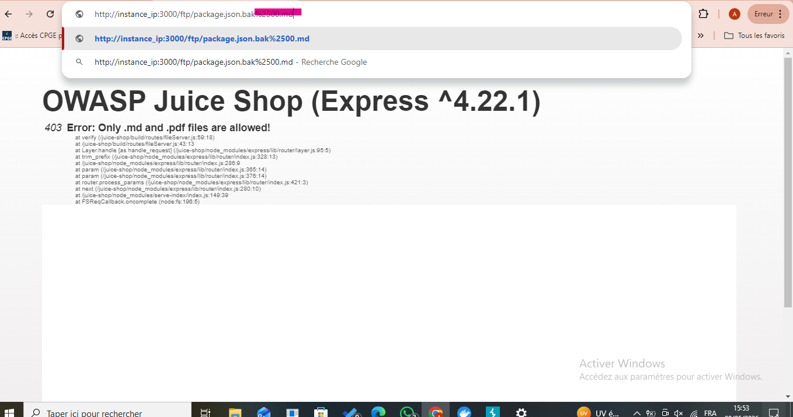

# Supply Chain Attack
**Difficulté**: ⭐⭐⭐⭐⭐
**Catégorie**: Vulnerable and Outdated Components

## Description
Informer l'équipe de développement d'un danger concernant certaines de leurs dépendances.

## Exploitation manuelle
1. Accédez au dossier ftp de l'application
2. Utilisez un Poison Null Byte (`%00`) avec `%` encodé en `%25` pour télécharger le fichier `package.json.bak` :
   ```
   http://[ip]:3000/ftp/package.json.bak%2500.md
   ```
3. Parcourez la liste des devDependencies et recherchez des vulnérabilités
4. Identifiez la dépendance `eslint-scope` en version 3.7.2
5. Consultez l'incident sur NPM : http://status.npmjs.org/incidents/dn7c1fgrr7ng
6. Récupérez l'URL du rapport original : https://github.com/eslint/eslint-scope/issues/39
7. Soumettez cette URL dans un commentaire sur la page de feedback pour valider le challenge

## Captures d'écran




